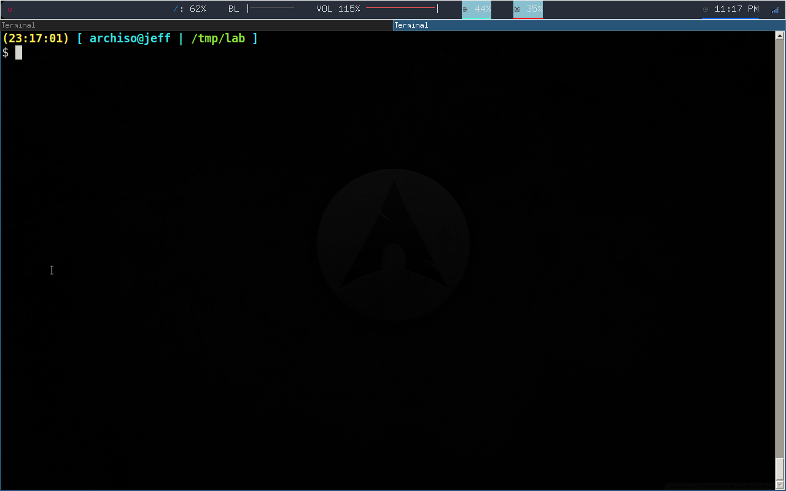

# infect.s

a basic x86 elf file infector written in pure x86 assembly targetting 32 bit Linux executables, using the Segment padding infection thechnique along with finding in-segment null-byte blocks

## assembling command

use this to assemble both the pivot and the payload file

pivot file : `nasm -f elf infect.s -o infect.o &&  ld -m elf_i386 infect.o -o infect && rm infect.o`

payload file : `nasm -f elf elf.s -o elf.o &&  ld -m elf_i386 elf.o -o elf && rm elf.o`

## requirements

there are 2 requirements for the payload, to be postion independent, and to contain a DWORD value of 0x69696969 inside of it, or else the infection won't happen, this is because the executable needs a known value that can be replaced with the original pivot file's entry point, so we can continue executing the pivot file normally after executing the injected payload

now the payload doesn't have to be null-byte-free but that's preferable as it helps to generate a smaller code

refer to elf.s to get an idea of what an accepted payload should look like

## quick demo
note : the payload segfaults because it's trying to return to `0x69696969` which is not a valid address, refer to `elf.s` to view the source code

## todo list

- document the undocumented routines
- rename elf.s to payload.s and apply the change to the readme file and the gif
- make a better demo.gif
- re-check error paths (except for open's and unmap's, those are working just fine) e.g go the debugger, make eax = -1 after each routine call and see if the infecter would segfault duo to some bad stack cleaning or not clean the resouces that it should be cleaning ( e.i calling close() and unmap() ) 
- optimize the original infecter 
- write a 64 version
- figure out a way to make it support both 32 and 64 elf files without writing every routine twice
- make it position indepedent then get rid of the null bytes (probably won't do this one)

any contribution would be much appreciated, tho it's preferable to be either an optimization of the already existed code or some theory that might help me add new features

## a special thanks

to pico (0x00pf) for his [original write up](https://0x00sec.org/t/elfun-file-injector/410) on elf file infection
